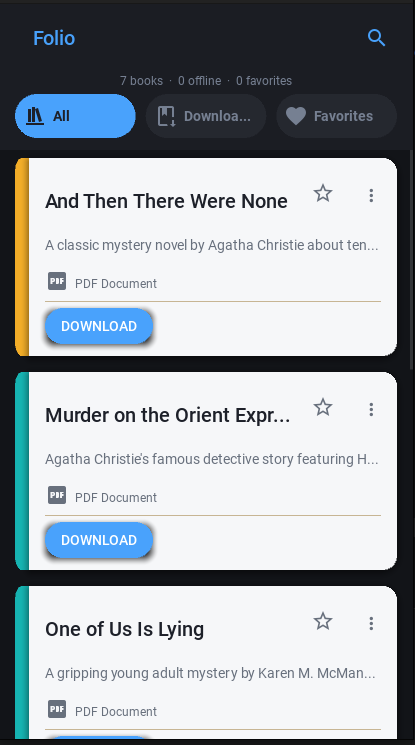
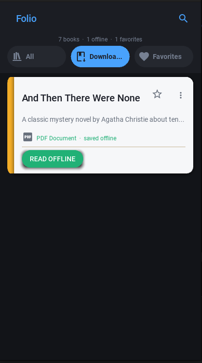
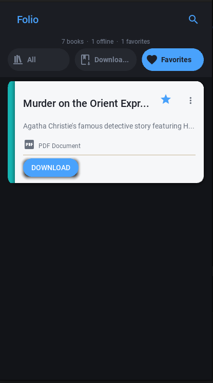

# 📚 Folio - Dynamic PDF Library App

A modern, dark-themed Android application built with Python (KivyMD) that allows users to browse, download, and read mystery novels directly from a remote JSON source. Features include offline reading, favorites management, smart search, and dynamic content updates without requiring APK rebuilds.


## ✨ Key Features

- **Dynamic Content:** Books are fetched from a remote `books.json` file on GitHub. Add new books by simply updating the JSON—no need to rebuild the APK!
- **Offline Reading:** Download PDFs to private app storage and read them anytime without internet.
- **Smart Filtering:** Toggle between "All", "Downloaded", and "Favorites" tabs instantly.
- **Search & Sort:** Real-time search filtering by title or description.
- **Dark Mode First:** Sleek dark theme with optional light mode toggle.
- **Favorites System:** Star your favorite books; they persist across sessions via local JSON storage.
- **Custom Background:** Supports custom background images for personalized UI.
- **No External Permissions:** Uses private app storage (`user_data_dir`), so no intrusive storage permissions are required.

## 📸 Screenshots

| Home Screen (Dark) | Downloaded Tab | Favorites Tab |
| :---: | :---: | :---: |
|  |  |  |
| *Main library view with all books* | *Shows only downloaded PDFs* | *Shows starred favorites* |

> **Note:** Replace the image paths above with your actual screenshot files after uploading them to a `screenshots/` folder in your repo.

## 🛠️ Tech Stack

- **Language:** Python 3.10
- **UI Framework:** Kivy + KivyMD 1.1.1
- **Build Tool:** Buildozer / python-for-android
- **Data Source:** Remote JSON (GitHub Raw)
- **Storage:** Private App Storage (No external permissions)
- **PDF Handling:** Android Native Intents

## 🚀 Installation & Setup

### Prerequisites

- Python 3.10+
- Git
- Java JDK 17+
- Android SDK & NDK (auto-downloaded by Buildozer)

### Local Development (PC Preview)

```bash
# Clone the repository
git clone https://github.com/SultanAhmmed/Folio.git
cd Folio

# Create and activate virtual environment
python3 -m venv .venv
source .venv/bin/activate

# Install dependencies
pip install kivymd==1.1.1 kivy cython pyjnius

# Run preview on PC
python test.py
```

### Build Android APK

```bash
# Install buildozer
pip install buildozer cython

# Initialize buildozer spec (if not present)
buildozer init

# Build debug APK
buildozer android debug

# The APK will be in ./bin/folio-0.1-arm64-v8a_armeabi-v7a-debug.apk
```

## 📂 Project Structure

```
Folio/
├── data/
│   ├── icon.png          # App icon (512x512 recommended)
│   └── background.png    # Optional app background image
├── bin/                  # Generated APKs
├── .buildozer/           # Build cache (add to .gitignore)
├── main.py               # Main application code
├── buildozer.spec        # Android build configuration
└── README.md
```

## ⚙️ Configuration

### Adding New Books

Edit your remote `books.json` file:

```json
[
  {
    "title": "Book Title Here",
    "desc": "Short description of the book.",
    "url": "https://raw.githubusercontent.com/user/repo/main/books/book.pdf"
  }
]
```

💡 **Tip:** Ensure filenames in URLs match exactly. Spaces are automatically converted to underscores for safe local storage.

### Customizing the App

- **App Name/Icon:** Edit `buildozer.spec` → `title`, `package.name`, `icon.filename`
- **Theme Colors:** Modify `self.theme_cls.primary_palette` in `test.py`
- **Background Image:** Place any PNG as `data/background.png`

## 🔧 Troubleshooting

| Issue | Solution |
| --- | --- |
| `buildozer: command not found` | Activate venv: `source .venv/bin/activate` then `pip install buildozer` |
| Tabs not switching colors | Fixed in v1.1.1 using `MDFillRoundFlatButton` + `.bind()` pattern |
| Downloaded tab shows empty | Delete old downloads and re-download (filename sanitization changed) |
| Toolbar crashes on load | Ensure `self.toolbar = MDTopAppBar(...)` uses `self.` prefix |
| PDF won't open on Android | Check StrictMode policy and `FLAG_GRANT_READ_URI_PERMISSION` |

## 📄 License

This project is licensed under the MIT License. See `LICENSE` for details.

## 🤝 Contributing

Contributions are welcome! Please feel free to submit a Pull Request. For major changes, please open an issue first to discuss what you would like to change.

## 👤 Author

**Sultan Ahmmed**
🔗 [GitHub Profile](https://github.com/SultanAhmmed)
📧 Contact via GitHub Issues